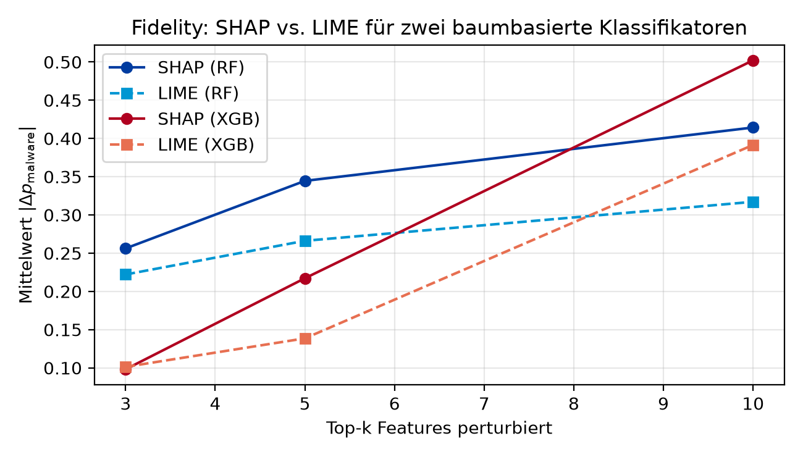

# XAI auf CIC-MalMem-2022: SHAP vs. LIME auf Random Forest

> Empirischer Vergleich der Post-hoc-Erklärungsverfahren **SHAP** (in der Variante TreeSHAP) und **LIME** für einen **Random-Forest-Klassifikator** zur Detektion memory-basierter Malware-Features (CIC-MalMem-2022). Die Übertragbarkeit der Beobachtungen wird auf einem zweiten baumbasierten Ensemble (XGBoost) überprüft.

Das Repository enthält Implementierung und Ergebnisse eines
Experiments, in dem die Erklärungsverfahren SHAP und LIME systematisch auf
einen Random-Forest-Klassifikator angewendet werden. Die zugrunde liegenden
Merkmale stammen aus dem Datensatz **CIC-MalMem-2022** und wurden über das
Volatility-Framework aus Memory-Dumps obfuszierter Malware extrahiert. Die
Evaluations-Methodik lehnt sich an Galadima et al. (2026) an und überträgt
deren für Deep-Learning-Modelle definierte Metriken auf einen Klassifikator
aus dem Bereich des klassischen maschinellen Lernens. Ergänzend erfolgt eine
qualitative Analyse der von den beiden Erklärungsverfahren identifizierten
Merkmale.

Um die Verallgemeinerbarkeit der Beobachtungen einzuordnen, werden dieselben
Metriken zusätzlich auf einem **XGBoost-Klassifikator** ausgewertet. XGBoost
dient als **Robustheits-Check** auf einem zweiten baumbasierten Ensemble; die
Primärbefunde beziehen sich weiterhin auf den Random Forest.



---

## Ergebnisse im Überblick

Die Auswertung erfolgt auf einem balancierten Subset des Test-Sets
(n = 1000; 500 benign, 500 malicious). Der Random Forest erreicht auf dem
vollständigen Test-Set eine Accuracy von 1.0000; XGBoost weist eine einzelne
Fehlklassifikation auf (Accuracy 0.9999).

**Primärbefund — Random Forest:**

| Metrik (top-5)                                       | SHAP (TreeSHAP)             | LIME    |
| ---------------------------------------------------- | --------------------------- | ------- |
| **Fidelity** (mittleres \|Δp\|)                      | **0.345**                   | 0.266   |
| **Robustness** (Jaccard, N = 5 Läufe)                | **1.000** (deterministisch) | 0.844   |
| **SHAP↔LIME Agreement** (Jaccard)                    | *0.458*                     | *0.458* |
| **Runtime** (Median pro Erklärung)                   | **0.4 ms**                  | 37.4 ms |

**Robustheits-Check — XGBoost:**

| Metrik (top-5)                                       | SHAP (TreeSHAP)             | LIME    |
| ---------------------------------------------------- | --------------------------- | ------- |
| **Fidelity** (mittleres \|Δp\|)                      | **0.217**                   | 0.139   |
| **Robustness** (Jaccard, N = 5 Läufe)                | **1.000** (deterministisch) | 0.728   |
| **SHAP↔LIME Agreement** (Jaccard)                    | *0.398*                     | *0.398* |
| **Runtime** (Median pro Erklärung)                   | **2.2 ms**                  | 23.7 ms |

**Zentrale Befunde (Random Forest):**

- Die von SHAP als relevanteste identifizierten Merkmale (top-5) erzeugen bei
  Perturbation eine im Mittel um rund acht Prozentpunkte stärkere Änderung
  der Klassifikationswahrscheinlichkeit als die entsprechenden Merkmale von
  LIME (0.345 vs. 0.266). SHAP-Erklärungen weisen damit eine höhere
  Übereinstimmung mit dem tatsächlichen Modellverhalten (Fidelity) auf.
- TreeSHAP ist deterministisch; wiederholte Läufe liefern identische
  Ergebnisse. LIME weist aufgrund seines stochastischen Sampling-Verfahrens
  eine mittlere Reproduzierbarkeit der Top-5-Rangfolge von 0.844 über fünf
  Wiederholungen auf.
- Die Übereinstimmung der Top-5-Merkmale zwischen beiden Verfahren beträgt
  im Mittel 0.458 (Jaccard-Index). Die qualitative Analyse zeigt, dass sich
  der Widerspruch systematisch entlang bestimmter Merkmale ausbildet:
  `svcscan.kernel_drivers` landet bei SHAP in 99.7 % aller Erklärungen in
  den Top-5, bei LIME in *keiner*. Umgekehrt bevorzugt LIME
  `svcscan.process_services` (100 %), das SHAP nur in 36.4 % der Fälle
  aufnimmt.
- TreeSHAP ist rund **94× schneller** als LIME (0.4 ms vs. 37.4 ms je
  Erklärung). Die in der Literatur häufig zitierte Einordnung von SHAP als
  rechenintensiv ist für das untersuchte Setting nicht zutreffend.

**Übertragbarkeit auf XGBoost.** Der Robustheits-Check bestätigt die
Rangfolgen: SHAP > LIME für Fidelity (0.217 vs. 0.139) und Runtime
(Vorsprung 11× statt 94×); Jaccard verbleibt unter 50 % (0.398). LIMEs
Robustness sinkt auf XGBoost auf 0.728 (Standardabweichung 0.122), was auf
eine Sensitivität gegenüber der Baumstruktur hindeutet. Die Kernbefunde am
Random Forest sind damit nicht klassifikator-spezifisch, unterscheiden sich
in ihrer Ausprägung jedoch messbar zwischen den beiden Ensembles.

---

## Reproduktion

```bash
git clone https://github.com/LeonRickert42/xai-malmem-comparison.git
cd xai-malmem-comparison
python -m venv .venv && source .venv/bin/activate
pip install -r requirements.txt

# Vollständige Reproduktion (~5–8 Minuten auf einem MacBook Pro mit M2-Pro-Chip, nur CPU)
python experiment.py
```

Der Datensatz ist aus lizenzrechtlichen Gründen nicht Bestandteil des
Repositories. Die Bezugsanleitung befindet sich in [`data/README.md`](data/README.md).

---

## Aufbau der Untersuchung

Die Implementierung erfolgt als deterministisches Script
([`experiment.py`](experiment.py); `random_state = 42`) und umfasst die
folgenden Schritte:

1. Einlesen des Datensatzes CIC-MalMem-2022 (58.596 Memory-Dumps,
   55 Volatility-Features).
2. Training des primären Klassifikators (`RandomForestClassifier`,
   `n_estimators = 100`, Defaults) sowie des XGBoost-Vergleichsmodells
   (`XGBClassifier`, `n_estimators = 100`, `tree_method = "hist"`,
   `eval_metric = "logloss"`) auf einem stratifizierten 80/20-Split.
3. Berechnung der Klassifikationsmetriken (Accuracy, Precision, Recall, F1,
   ROC-AUC) für beide Modelle.
4. Auswahl eines balancierten XAI-Subsets (n = 1000, je 500 Instanzen pro
   Klasse). Auf demselben Subset werden für beide Klassifikatoren sowohl
   TreeSHAP als auch LIME angewendet, sodass sämtliche Metriken paarweise
   vergleichbar sind.
5. Auswertung der Erklärungen entlang vier Metriken nach
   Galadima et al. (2026):
   - **Fidelity** — Perturbations-basierte Änderung von $p_{\mathrm{malware}}$
     bei Ersetzung der Top-k Features durch den Trainings-Median.
   - **Robustness** — Mittlerer paarweiser Jaccard-Overlap der Top-k Sets über
     N wiederholte Läufe mit unterschiedlichen Zufallsseeds.
   - **Inter-Explainer Agreement** — Jaccard-Index zwischen den Top-k
     Merkmalen von SHAP und LIME auf identischen Instanzen.
   - **Runtime** — Wall-Clock-Zeit je Erklärung.
6. Qualitative Feature-Analyse (auf dem Random Forest): Auszählung, in
   welchem Anteil der 1000 Instanzen einzelne Merkmale in den Top-5 von SHAP
   bzw. LIME auftauchen.
7. Persistierung der Ergebnisse als PDF- und PNG-Grafiken sowie CSV- und
   JSON-Dateien unterhalb von [`results/`](results/).

---

## Struktur des Repositories

```
xai-malmem-comparison/
├── experiment.py            # deterministische End-to-End-Pipeline
├── requirements.txt         # festgelegte Paket-Versionen
├── data/                    # Datensatz-CSV (nicht versioniert)
│   └── README.md
└── results/
    ├── figures/             # fig3_fidelity, fig4_jaccard, fig5_feature_frequency (PDF + PNG)
    └── tables/              # Ergebnistabellen (CSV) sowie run_metadata.json
```

Sämtliche Artefakte unter `results/` wurden durch Ausführung von
`python experiment.py` auf einem MacBook Pro (M2 Pro) unter macOS mit den in
`requirements.txt` festgelegten Paket-Versionen erzeugt.

---

## Methodische Grundlagen

**SHAP (Shapley Additive Explanations)** [Lundberg & Lee, 2017] weist jedem
Feature einen additiven Beitrag zur Modellvorhersage zu. Die Zuschreibung
basiert auf dem Konzept der Shapley-Werte aus der kooperativen Spieltheorie.
Für baumbasierte Modelle ermöglicht die Variante **TreeSHAP** [Lundberg
et al., 2020] eine effiziente und exakte Berechnung durch Ausnutzung der
Baumstruktur. Erklärungen sind deterministisch; die Summe aller
Feature-Beiträge zuzüglich eines Basiswertes entspricht exakt dem
Modell-Output. TreeSHAP ist sowohl auf Random Forest als auch auf XGBoost
nativ anwendbar, was den paarweisen Vergleich beider Klassifikatoren mit
identischem Erklärungsverfahren ermöglicht.

**LIME (Local Interpretable Model-agnostic Explanations)** [Ribeiro et al.,
2016] verfolgt einen abweichenden Ansatz. In der Umgebung der zu erklärenden
Instanz wird das Black-Box-Modell durch ein einfaches lineares
Surrogatmodell lokal approximiert. Grundlage der Approximation sind zufällig
gezogene Perturbationen der Ausgangsinstanz, deren Klassifikation über das
Originalmodell erfolgt. Die Koeffizienten des Surrogats bilden die
Erklärung. Aufgrund des stochastischen Sampling-Verfahrens sind
LIME-Erklärungen nicht deterministisch.

---

## Datensatz

Der Datensatz CIC-MalMem-2022 ist nicht Bestandteil des Repositories. Die
Bezugsanleitung, eine Beschreibung der enthaltenen Merkmale sowie die
Zitationsangabe finden sich in [`data/README.md`](data/README.md).

---

## Lizenz

MIT — siehe [`LICENSE`](LICENSE). Der Datensatz CIC-MalMem-2022 unterliegt
den Bedingungen des Canadian Institute for Cybersecurity.
